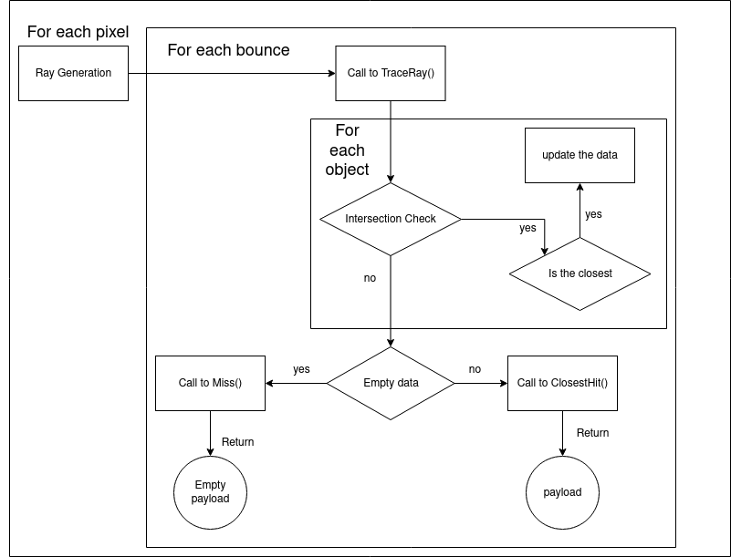

# Ray tracer

## Table of Content

- [Introduction](#introduction)
- [The GUI](#the-gui)
- [Build](BUILD.md)
- [Step to Reach](#step-to-reach)
- [GLM Most Useful functions](#glm-most-useful-functions)
- [To improve your render](#to-improve-your-render)
- [Helpful Ressource](#helpful-ressources)

## Introduction

The goal of the project is to build your first simple ray tracer on CPU.

The given code is a fill-in-the-blank exercise but you have to do the most important part. The given part is a GUI described below.

Exercise are written in blue.

## The GUI

On the Gui, you have the real-time render in the panel Viewport, the help explained How to move in the scene with the camera. The settings panel allow you to move the camera by cursor or to choose some preset.

## Step to Reach

### Orient the ray

 First of all, in [Camera.cpp](src/raytracing/core/Camera.cpp), in `Raytracing::Camera::updateRay` we have to build our rays and store it in `rayDirections` table.
 
 We have a camera point, a lookAt point and a horizontal Field Of View (FOV). Pixel have (x, y) coordinated from (0, 0) to (width, height) from top left to bottom right. First, we compute a relative value from the (x, y) to a value from (1, 1) (top left) to (-1, -1) (bottom right).

x relative : $
    r_x = -2 * \frac x{\text{width - 1}} + 1
$

y relative : $
    r_y = -2 * \frac y{\text{height - 1}} + 1
$

The ray direction of the screen pixel is given by the uniform vector from the camera origin to the point in the screen $\left (\begin{matrix}r_x \\ r_y \\ focal\end{matrix} \right )$ in the systeme of the camera.

### Manage rays

Now, you have rays directions for your camera, now it's time to render your first scene.  In [renderer.cpp](src/raytracing/controller/Renderer.cpp), fill the double for loop to manage each ray/pixel of the screen, in this first step you have to fill it in the same color  (we will considere it has the sky #019CE0 for example). This color will be render if nothing is render.

### Intersection with sphere

In [Sphere.cpp](src/raytracing/core/hittableObject/Sphere.cpp), we now have to find if the ray instersect a sphere, fill the `intersect` function which return the distance of the hit, a negative one if does not hit the sphere.

We suppose the point $h = O_{\text{ray}} + t\cdot D_{\text{ray}}$ where $O_{\text{ray}}$ is the origin of the ray and $D_{\text{ray}}$ is the direction of the ray (uniform).

Now, with $O_{\text{sphere}}$ origin of the sphere and $R_{\text{sphere}}$ the radius of the sphere, we have :

$$
\begin{split}
h \in S(O_{\text{sphere}}, r_{\text{sphere}})
    &\iff \vert\vert h - O_{\text{sphere}} \vert\vert = r_{\text{sphere}} \\
    &\iff \vert\vert h - O_{\text{sphere}} \vert\vert ^2 = r_{\text{sphere}}^2 \\
    &\iff < h - O_{\text{sphere}}| h- O_{\text{sphere}} > - r_{\text{sphere}}^2 = 0 \\
    &\iff <O_{\text{ray}} + t\cdot D_{\text{ray}} - O_{\text{sphere}}| O_{\text{ray}} + t\cdot D_{\text{ray}}- O_{\text{sphere}}> - r_{\text{sphere}}^2 = 0 \\
    &\iff <t\cdot D_{\text{ray}} + O_{\text{ray}} - O_{\text{sphere}}| t\cdot D_{\text{ray}} + O_{\text{ray}} - O_{\text{sphere}}> - r_{\text{sphere}}^2  = 0 \\
    &\iff <t\cdot D_{\text{ray}} | t\cdot D_{\text{ray}}> + 2 t \cdot <D_{\text{ray}} |  O_{\text{ray}} - O_{\text{sphere}}> + <O_{\text{ray}} - O_{\text{sphere}} | O_{\text{ray}} - O_{\text{sphere}}> - r_{\text{sphere}}^2  = 0 \\
    &\iff <t\cdot D_{\text{ray}} | t\cdot D_{\text{ray}}> + 2 t \cdot <D_{\text{ray}} |  O_{\text{ray}} - O_{\text{sphere}}> + <O_{\text{ray}} - O_{\text{sphere}} | O_{\text{ray}} - O_{\text{sphere}}> - r_{\text{sphere}}^2  = 0 \\
    & \iff t^2 || D_{\text{ray}}||^2 + 2 t \cdot <D_{\text{ray}} | \overrightarrow{O_{\text{ray}}O_{\text{sphere}}}>  + || \overrightarrow{O_{\text{ray}}O_{\text{sphere}}}||^2 - r_{\text{sphere}}^2 = 0 \\
\end{split}
$$

As $ D_{\text{ray}} $ is uniform, we can ignore it. The rest is a quadratic equation. 

A solution to this equation mean a hit from the ray to the sphere. If the solution is negative, it means that the sphere is behind the camera.

### Render your first sphere

In [App.cpp](src/raytracing/gui/App.cpp), in the constructor, you have to add a first material to your and then scene the sphere you want.

Now, in [Renderer.cpp](src/raytracing/controller/Renderer.cpp), modify the render script to check the intersection between rays and the sphere.

The list of Sphere is available by the call of `getListSphere()`.

### Render a second sphere (maybe a floor)

To simulate the presence of a floor, we can add a material to the scene in [App.cpp](src/raytracing/gui/App.cpp) (color example : gray, shinyness : midShinyness, roughness : fullRoughness) and a floor sphere at `floorPos` and a radius of 1000.

### Introduction to Ray tracer pipeline

The image below explain the raytracer pipeline and the role of `TraceRay` function.

After the Call of TraceRay you have to handle the returned payload. If the payload is empty, we display the sky, else for now we bounce on the surface and register the color of the sphere hit.

Move the intersection test in `Raytracing::Render::TraceRay` function in [Renderer.cpp](src/raytracing/controller/Renderer.cpp).

Fill the payload in ̀̀`Raytracing::Renderer::ClosestHit` and `Raytracing::Renderer::Miss`, use object method as `getNormal`.

### Render with a simple bounce

we want to see interaction between the two sphere. We are going to use the constants define `BOUNCES` to known how many bounce a ray should do. So, we should create a bounce.

For the first modelisation of a bounce we are going to ignore the roughness characteristic of materials and bounce perfectly on sphere. To bounce we need to know where the hit has been done and the normal of the sphere at this point.

Fill the `Raytracing::Sphere::getNormal` function in [Sphere.cpp](src/raytracing/core/hittableObject/Sphere.cpp).

Then we change the ray origin to the hit position shifted by an epsilon times the normal to not hit the same sphere again. The new direction of the ray can be computed by the function `glm::reflect(incident vector, normal vector)`.

Adapt the `Raytracing::Renderer::Render` in [Renderer.cpp](src/raytracing/controller/Renderer.cpp) to add a bounce reaction to your ray.

To know the color of a ray, we start with a white color and a shiny multiplier. At each hit sphere we multiply the current ray color by the shiny multiplier and the color of the hit material. Then we mutiply the shiny multiplier by the hit material shinyness. Like that, a mat material will not be affect by the next hit color and a shiny material will be fully affect by the next hit.

### First Lighting

We want now to add lighting effect in our scene.

Add a light effect in `Raytracing::Renderer::Render` in [Renderer.cpp](src/raytracing/controller/Renderer.cpp) the light is fully add by the sky for now but to prepare to next improvement, we should add a modifier as color or shiny multiplier to controle the light.

Just like in real life, the light should have 3 components for Red, Green and Blue. the sky should have a white light independently to its color, so when a ray does not hit anything (the sky), we add to the light component the $\begin{pmatrix}1 & 1 & 1\end{pmatrix}$ vector.

### Improve a bounce

In [Renderer.cpp](src/raytracing/controller/Renderer.cpp), add a random component for our bounce depending on the roughness of the material.

The more a material is roughness, the more the bounce will be random. So the bounce formula become with $r$ the roughness of the material, $\overrightarrow{n_p}$ the normal to the hitpoint :

$$
\overrightarrow{v_r} = r \cdot (\overrightarrow{n_h} + r \cdot \overrightarrow{noise_N}) + (1 - r) \cdot (\overrightarrow{r} + r \cdot \overrightarrow{noise_R})
$$

Noise vector are random unit vector.

We should have an image with constant modification.

### Stabilize the image

We want to stabilize the image using a accumulator. The field `accumulatedData` is made for it.

Use `accumulatedData` in [Renderer.cpp](src/raytracing/controller/Renderer.cpp) to get a smoother image.

### Add emmissive material

Fill the `Raytracing::Renderer::getAttenuation` in [Renderer.cpp](src/raytracing/controller/Renderer.cpp) function to fit with the `Raytracing::Renderer::getFormulatoString` function.

Simulate light emission by sphere as lamp to get a better image in [Renderer.cpp](src/raytracing/controller/Renderer.cpp).

We arge going to use the emissive color characteristic, the emissive power and the attenuation radius of material to do it. At each bounce on a surface, we can add to the light modifier the product of the light color by its emission power (`mat.getEmission()`) and by the attenuation of light depending to the distance.

### Translucid material

We should add some translucid object as plexiglass in our scene. But to do this, we need to implement refraction in our model.

Change the bounce computation to include a refraction handler in [Renderer.cpp](src/raytracing/controller/Renderer.cpp).

To determine if a ray should be reflect or be refract we are going to use the [Schlick approximation](https://en.wikipedia.org/wiki/Schlick%27s_approximation).

Then, a ray is reflect if the angle of incidence is above the limit angle of total reflection or if a random tirage is under $r_\theta$. Else it is refract.

See [GLM Functions](#glm-most-useful-functions) below may help you.

## GLM Most Useful functions

 - `glm::vec3` : vector of size 3
 - `glm::normalize` : normalize a vector
 - `glm::reflect` : reflect a incident vector according to a normal
 - `glm::refract` : refract a incident vector according to a normal and $\frac{n_1}{n_2}$
 - `glm::to_string` after add `#define GLM_ENABLE_EXPERIMENTAL` and `#include <glm/gtx/string_cast.hpp>` in the header : print a vector (use : `std :: cout << glm::to_string(glm::vec3(0)) << std :: endl;` prints the 0 vector of dimension 3).

## To improve your render

You can test to replace the floor material by a metalic mirror with the modifiers :
 - color : gray
 - shiny : shiny
 - roughness : noRoughness

You can add a sky blue gradient color according to the y direction of the ray.
$$
\text{color} = 
\begin{pmatrix}
\frac{(1 - |y_{\text{ray}}|)} 2 + 0.3
& \frac{(1 - |y_{\text{ray}}|)} 2 + 0.3
& 1
\end{pmatrix}
$$

You can implement other surface type as torus or plan.

## Helpful ressources

 - A youtube video serie : [Raytracing serie](https://www.youtube.com/watch?v=gfW1Fhd9u9Q&list=PLlrATfBNZ98edc5GshdBtREv5asFW3yXl)
 - A good website : [Raytracing in One Week-end](https://raytracing.github.io/books/RayTracingInOneWeekend.html)
